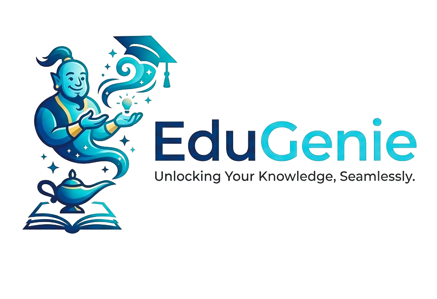
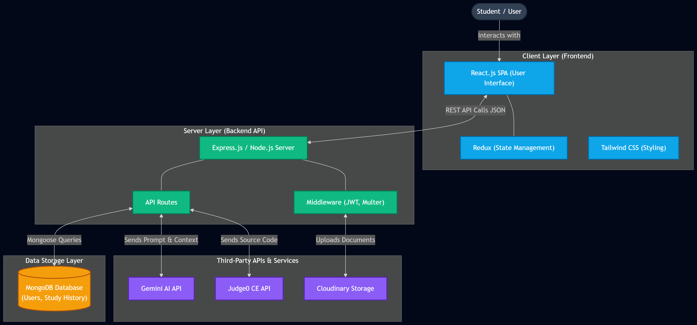
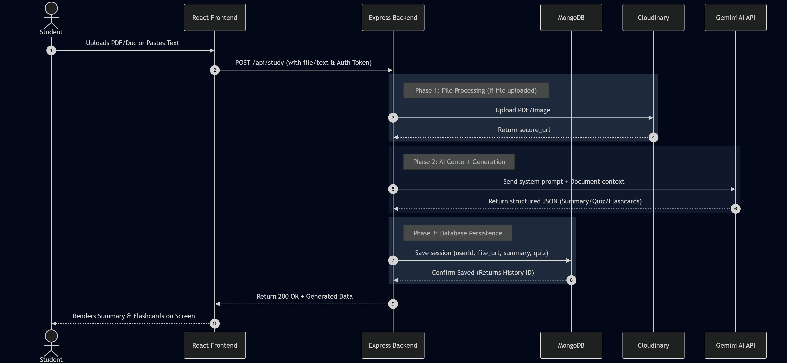
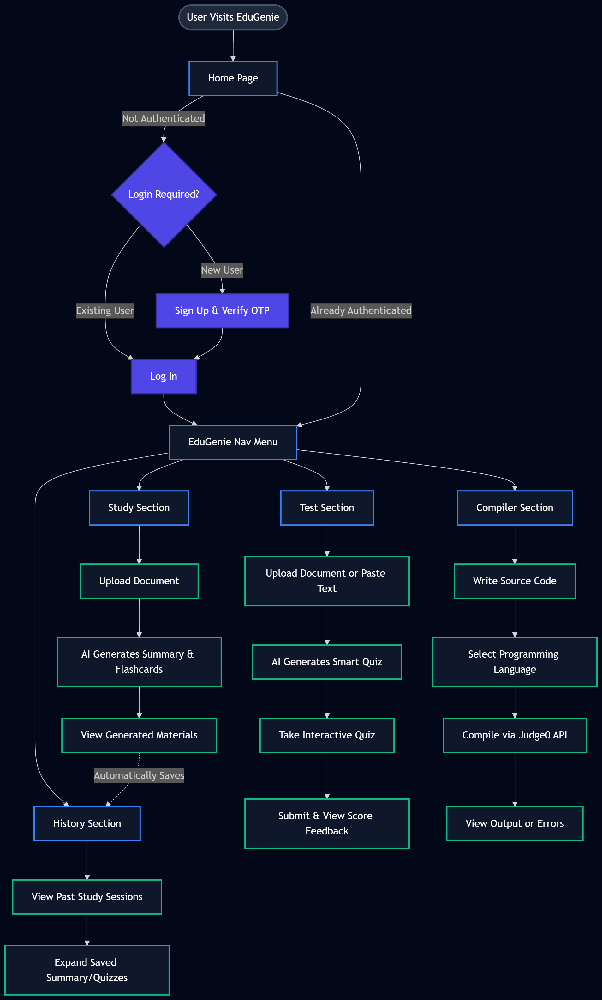
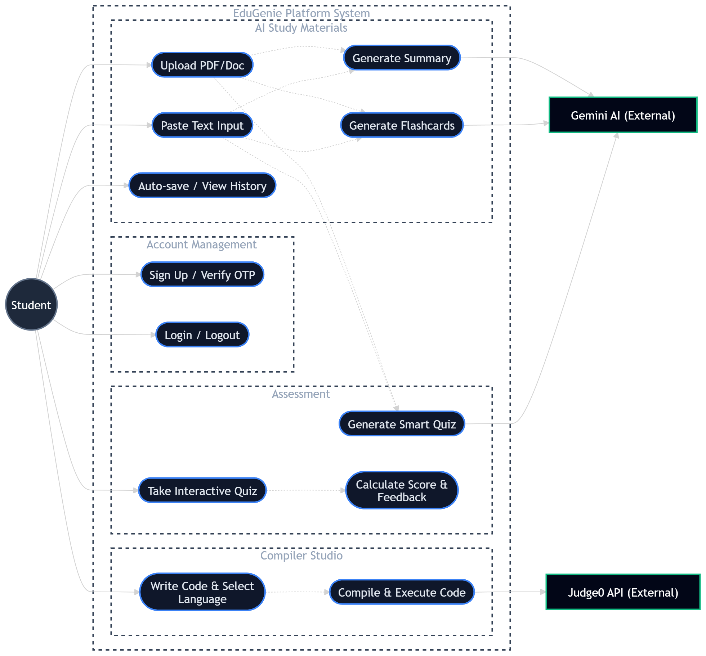

# 🎓 EduGenie - AI Powered Learning Assistant

<p align="center">
  
</p>

<p align="center">
  <strong>Learn Faster. Revise Smarter. Ace Your Exams.</strong>
</p>

---

# 📖 Overview

**EduGenie** is an AI-powered learning platform built using **React, Node.js, MongoDB, and Large Language Models (LLMs)**. The application helps students learn and revise topics quickly by generating:

* 📄 Smart Summaries
* 🧠 Flashcards
* ❓ AI-Generated Quizzes
* 💻 Online Code Compiler
* 📚 Study Material from PDFs, DOCX files, and Text

The platform is specially designed for students preparing for exams who need to understand and revise large amounts of content in a short time.

---

# ✨ Key Features

## 🔐 Authentication System

* User Registration
* User Login
* JWT Authentication
* Password Encryption using bcrypt

---

## 📄 Document Processing

Upload:

* PDF Files
* DOCX Files
* Plain Text

The system extracts the content and sends it to the LLM for processing.

---

## 📝 AI Summary Generation

Generates concise and easy-to-understand summaries from uploaded documents.

Benefits:

* Saves study time
* Highlights important concepts
* Perfect for last-minute revision

---

## 🧠 Flashcard Generation

Creates question-answer flashcards automatically.

Benefits:

* Active Recall Learning
* Memory Retention
* Quick Revision

---

## ❓ Quiz Generator

Creates MCQs and practice questions from:

* PDFs
* DOCX files
* User-entered text

Benefits:

* Self Assessment
* Exam Preparation
* Instant Revision

---

## 💻 Online Compiler

Allows students to write and execute code directly inside the platform.

Supported Languages:

* C++
* Java
* Python
* JavaScript

---

# 🏗️ Tech Stack

| Category            | Technology        |
| ------------------- | ----------------- |
| Frontend            | React.js          |
| Backend             | Node.js           |
| API                 | Express.js        |
| Database            | MongoDB Atlas     |
| Authentication      | JWT + bcrypt      |
| State Management    | Redux             |
| AI                  | Gemini API        |
| File Storage        | Cloudinary        |
| Document Processing | PDF & DOCX Parser |

---

# 📂 Project Structure

```text
EduGenie
│
├── backend
│   ├── models
│   ├── routes
│   ├── uploads
│   ├── server.js
│   └── .env
│
├── frontend
│   ├── public
│   │   ├── diagrams
│   │   └── images
│   └── src
│       ├── components
│       ├── redux
│       └── App.js
│
└── README.md
```

---

# 🚀 System Architecture



---

# 🔄 Sequence Diagram

This diagram explains the complete flow from document upload to AI-generated study material.



### Workflow

1. Student uploads PDF/DOCX or enters text.
2. React frontend sends data to Express backend.
3. Backend uploads file to Cloudinary.
4. Backend extracts text content.
5. Context is sent to Gemini API.
6. Gemini generates:

   * Summary
   * Flashcards
   * Quiz
7. Data is stored in MongoDB.
8. Response is returned to frontend.
9. Student starts learning and revision.

---

# 📊 Flow Chart



---

# 👤 Use Case Diagram



---

# 🏛️ System Architecture Description

## Frontend (React)

Responsible for:

* User Authentication
* File Upload Interface
* Study Material Display
* Flashcards UI
* Quiz Interface
* Compiler Interface

---

## Backend (Node.js + Express)

Responsible for:

* Authentication APIs
* File Processing
* LLM Integration
* Business Logic
* Database Communication

---

## MongoDB Atlas

Stores:

* User Information
* Generated Summaries
* Flashcards
* Quiz History
* Study Sessions

---

## Gemini API (LLM)

Responsible for:

* Text Understanding
* Summary Generation
* Quiz Generation
* Flashcard Creation

---

## Cloudinary

Responsible for:

* File Storage
* Document Hosting
* Secure URLs

---

# 🧠 RAG Based Architecture

EduGenie follows a **Retrieval-Augmented Generation (RAG)** approach.

```text
User Document
      ↓
Document Parsing
      ↓
Context Extraction
      ↓
Gemini LLM
      ↓
Summary + Quiz + Flashcards
      ↓
Database Storage
      ↓
Student Revision
```

---

# 📡 API Endpoints

## Authentication

```http
POST /api/auth/register
POST /api/auth/login
```

---

## Study APIs

```http
POST /api/study
GET /api/history
GET /api/flashcards
GET /api/quiz
```

---

# ⚙️ Installation

## Clone Repository

```bash
git clone https://github.com/yourusername/EduGenie.git
cd EduGenie
```

---

## Backend

```bash
cd backend
npm install
npm start
```

---

## Frontend

```bash
cd frontend
npm install
npm start
```

---

# 🔐 Environment Variables

```env
PORT=5000

MONGO_URI=

JWT_SECRET=

GEMINI_API_KEY=

CLOUDINARY_CLOUD_NAME=

CLOUDINARY_API_KEY=

CLOUDINARY_API_SECRET=
```

---

# 🎯 Benefits for Students

✅ Learn large topics quickly.

✅ Revise before exams in minutes.

✅ Generate instant quizzes.

✅ Improve memory using flashcards.

✅ Practice coding in one platform.

✅ Personalized AI-powered learning experience.

---

# 🔮 Future Enhancements

* Voice-based learning assistant
* AI Chatbot Tutor
* Multilingual Support
* Study Progress Analytics
* Personalized Learning Paths
* Spaced Repetition System
* Mobile Application

---

# ⭐ If you like this project, don't forget to star the repository.
